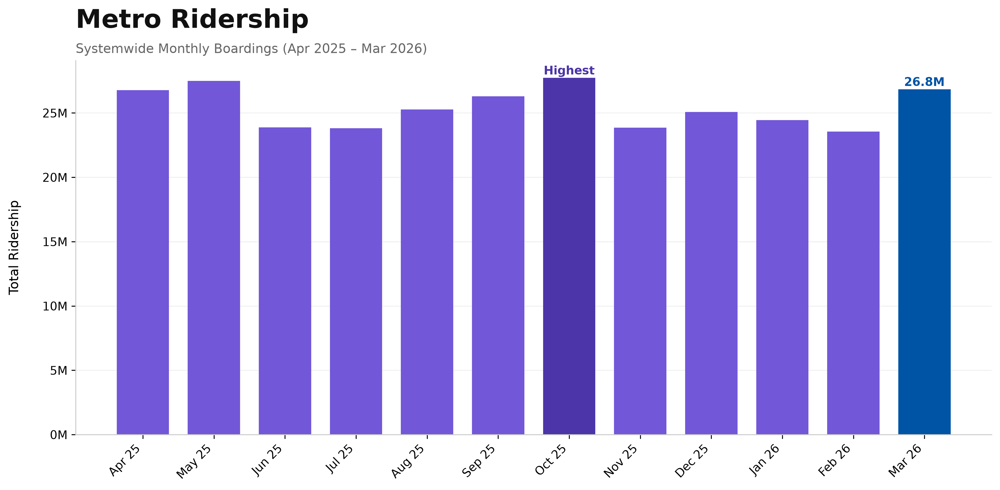

# LA Metro Ridership Analytics

LA Metro Ridership Analytics is a Python project that explores monthly ridership trends using real LA Metro Open Data.

I built this project to practice working with a real-world dataset, analyzing trends with Python, creating visualizations with Matplotlib, and generating a simple PDF report.

## Features

- Import and analyze ridership data with pandas
- Calculate summary statistics and monthly changes
- Generate visualizations with Matplotlib
- Export a text summary and PDF report
- Organize code into reusable Python modules

## Built With

- Python
- pandas
- Matplotlib
- ReportLab

## Why I Built This

I wanted to build a small end-to-end analytics project that went beyond creating charts. This project gave me experience loading data, organizing an analysis workflow, generating visualizations, and producing simple reports from a real dataset.

## Skills Practiced

- Data analysis with pandas
- Exploratory data analysis (EDA)
- Data visualization with Matplotlib
- Modular Python project organization
- Automated report generation

---

Monthly ridership data is based on LA Metro Open Data.

Built by **Frejya Lindh** as part of my developer portfolio.
